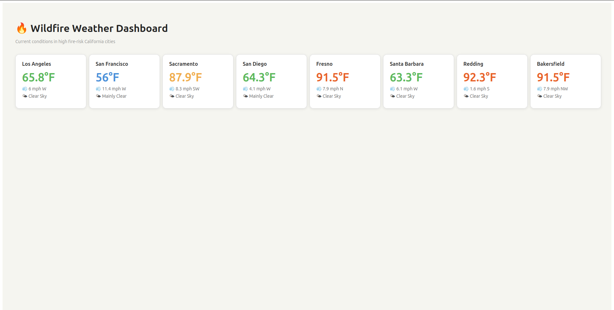

# Wildfire Weather Dashboard

## 🌐 Live Demo
**https://wildfire-dashboard-853564661918.us-central1.run.app**



Deployed on Google Cloud Run via Docker container.
A real-time weather dashboard for high fire-risk California cities, built with ClojureScript and Reagent.

## Stack
- **ClojureScript** — Lisp dialect compiling to JavaScript
- **Reagent** — ClojureScript wrapper for React
- **shadow-cljs** — ClojureScript build tooling with hot reload
- **Open-Meteo API** — free weather data, no API key required

## Features
- Live weather data for 8 high fire-risk California cities
- Temperature color-coded by fire risk (blue → green → orange → red)
- Wind speed and compass direction
- Human-readable weather descriptions

## Setup

### Prerequisites
- Java 21+
- Node.js 20+
- shadow-cljs (`npm install -g shadow-cljs`)

### Run locally
```bash
npm install
shadow-cljs watch app
```
Open http://localhost:8080

## Project structure
## Key Clojure concepts demonstrated
- `r/atom` for reactive state management
- `swap!` for immutable state updates
- Reagent components as plain functions returning Hiccup
- JavaScript interop (`js/fetch`, `js->clj`)
- Threading macro `->` for data transformation
- `doseq` for parallel API calls
